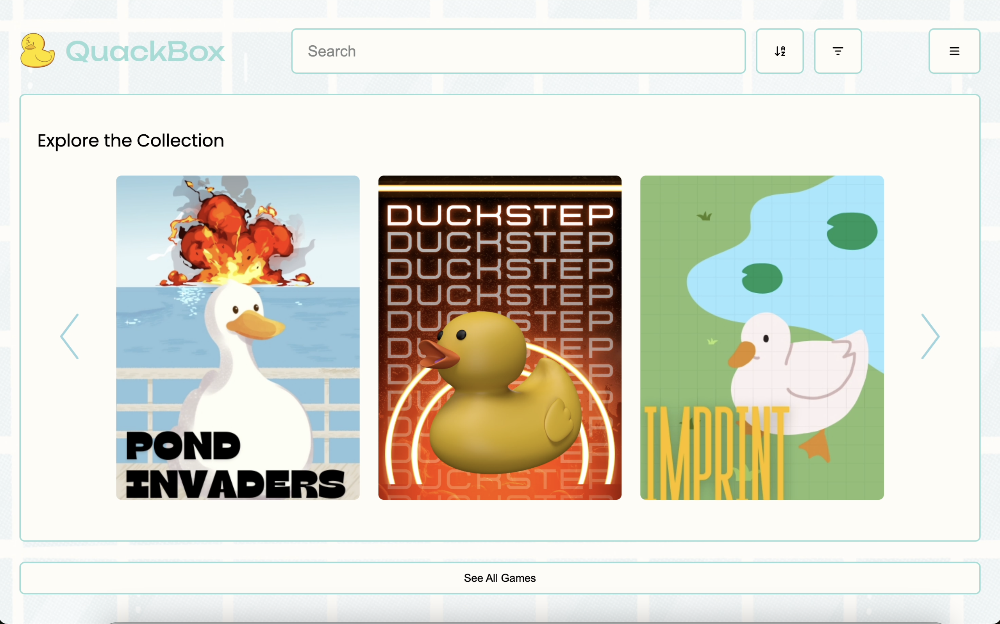

# QuackBox Frontend

The frontend of the QuackBox is build with **React** and **JavaScript**, designed for scalable and maintainable UI development. It leverages the shared components from the QuackBox Design System for consistency and efficient development.

# Table of Contents
- [Project Structure](#project-structure)
- [Design System](#design-system)
- [React Contexts](#react-contexts)
- [References](#references)

# Project Structure

```bash
.
├── assets/          # Media used within the frontend
├── components/      # Reusable component blocks
├── contexts/        # React contexts for global state and utilities
├── hooks/           # Custom hooks
├── pages/           # Top-level page views
├── styles/          # Global styles
└── ...
```

# Design System
This project relies on the [quackbox-design-system](https://github.com/rit-coms/quackbox-design-system), a Typescript-based component library. All components are versioned and published via [npm](https://www.npmjs.com/package/quackbox-design-system).

### Figma
A Figma project exists that contains legacy designs and current in-progress ideas. Please contact the Tech Projects Chair for access.

### Installation
```bash
npm install quackbox-design-system
```

### Type Checking
> [!TIP]
> To catch incorrect or missing props from the design system components, add `// @ts-check` at the top of JavaScript files

```javascript
// @ts-check
import { Button } from 'quackbox-design-system'

const MyComponent = () => {
  return <Button></Button> // this line will warn if required props are missing
}
```

# React Contexts
Several contexts are defined in the `contexts` folder to manage shared logic. A React Context lets the parent component make information available to any child component without passing it explicitly through props.

The values provided through each context are accessible via each respective context's custom defined hook. Below is an overview of the `GamepadContext` and `PageContext`. More documentation can be found within each file.

## Gamepad Context
The `GamepadContext.jsx` file handles the event listeners that respond to and handle gamepad connection and disconnection.

```
window.addEventListener("gamepadconnected", handleGamepadConnected);
window.addEventListener("gamepaddisconnected", handleGamepadDisconnected);
```

Connected gamepads are polled every 100 milliseconds to listen for button presses. A dictionary of the applicable buttons are defined at the top of the file.

```
const BUTTONS = {
  0: "B",
  1: "A",
  ...
};
```
> [!NOTE]
> These defined buttons mappings are for an SNES controller used with a macOS operating system. The inputs may be different for another operating system. An [online gamepad tester](https://hardwaretester.com/gamepad) can be used to determine the correct mappings.

### Keybinds
The GamepadContext features a `KEYMAP` which mocks the connection, disconnection, and usage of a controller via keyboard keys. See [Keybinds](./context/Keybinds.md) for a complete description of each keybind function.

### Adding New Button Functionality
Within the GamepadContext, the `setButtonAction(keyOrButton, action)` is defined to aid in adding new functionality to buttons already defined in the `BUTTONS` dictionary or keyboard keys already defined in the `KEYMAP` dictionary.

#### Usage

```javascript
import { useEffect } from 'react';
import { useGamepadContext } from "contexts";

const MyComponent = () => {
  const { setButtonAction } from useGamepadContext();

  // Add action for 'j' key
  useEffect(() => {
    setButtonAction('j', (event) => {
      console.log('j key was pressed!', event);
    });
  }, []);

  // Add action for gamepad button index 2 ('Y' on SNES)
  useEffect(() => {
    setButtonAction(2, (index, button) => {
      console.log(`Button ${index} pressed on gamepad`, button);
    });
  }, []);

  return <div>Press Something!</div>
};
```

## Page Context
The `PageContext.jsx` file defines the allowable, focusable elements the gamepad can view and click on within the page. It also defines basic player navigation using D-pad controls and `A` to click elements.

All pages within the front end have their element hierarchies **hard coded, top down** in the `getPageHierarchy(page)` function. The elements queried in this function allow the `playerFocus` dictionary to highlight the element each player is currently focused on.

### Home Page Hierarchy Example



The Home Page consists of 2 different hierarchies—the top navigation bar and the bottom game gallery games (`See All Games` button functionality has been disabled). `querySelectorAll` returns an **array of elements** that fit the defined [attribute selector](https://developer.mozilla.org/en-US/docs/Web/CSS/Attribute_selectors). Each element imported from the QuackBox Design System has a `dataId` prop that can help query its element(s) for this purpose.    

``` javascript
case "home page": return {
    0: document.body.querySelectorAll("[data-id^='navigation']"),
    1: document.body.querySelectorAll("[data-id='game-container'] > [data-id^='game']"),
};
```
If an new, focusable element is added to the page, the page hierarchy must be updated to reflect the navigation change. All keys in the dictionary must remain sequential.

``` javascript
case "home page": return {
    0: // focusable elements above the navigation
    1: document.body.querySelectorAll("[data-id^='navigation']"),
    2: // focusable elements between the navigation and games
    3: document.body.querySelectorAll("[data-id='game-container'] > [data-id^='game']"),
    4: // focusable elements below the games
};
```

### Player Navigation


Basic player D-pad navigation is included in this file and automatically applied across all child pages within the Page Context. This prevents repetitive definition of navigation logic per page.

The first player to connect has the ability to click actionable elements (typically mapped to the `A` button or equivalent). If that player disconnects, control transfers to the next connected player.


# References
- [Gamepad API behavior](https://developer.mozilla.org/en-US/docs/Web/API/Gamepad_API)
- [CSS Attribute Selectors](https://developer.mozilla.org/en-US/docs/Web/CSS/Attribute_selectors)
- [DOM QuerySelectAll](https://developer.mozilla.org/en-US/docs/Web/API/Document/querySelectorAll)
- [React Contexts](https://react.dev/learn/passing-data-deeply-with-context)
- [TypeScript checks within a JavaScript project](https://www.typescriptlang.org/docs/handbook/intro-to-js-ts.html#ts-check)